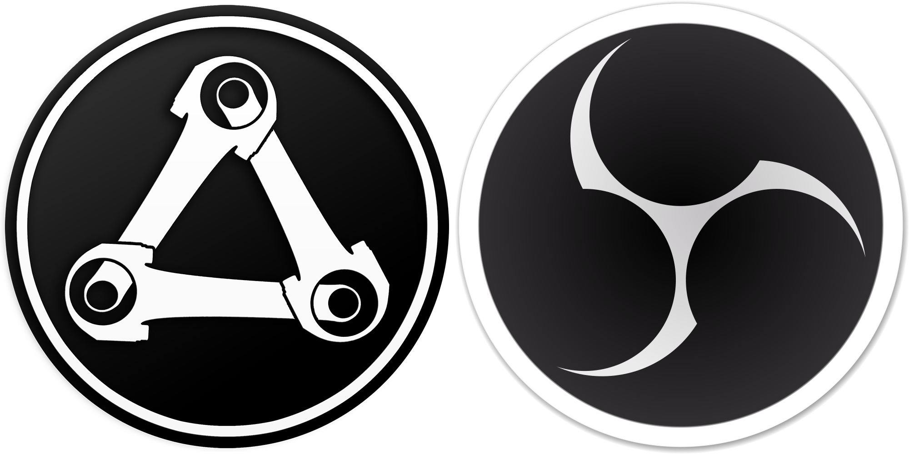

# Syndicate Motorsports OBS Display

This is the repo of Syndicate Motorsports OBS Displays and Overlays. You can see them live in action at
https://twitch.tv/syndicatemotorsports. Also join our Discord at https://discord.gg/BcBKQ7w6WB

## How It Works

1. The data gets pulled from our servers
2. React renders them dynamically in a website
3. The website can be displayed as a browser-source inside OBS

## Patch Notes

**Version 0.0.1**
- Added `SimpleDriverData`-component
- Added `ScrollingChampionshipStandings`-component
- Added `VerticalChampionshipStandings`-component

## Roadmap
- More components
- Add animations
- Pull data from servers
- 
## Storybook
- You can see all components on their own with Storybook. For this follow the installation-steps but instead of running `npm run start` run `npm run storybook dev -p 6006`

## Prerequisites
- NodeJS - [Download here](https://nodejs.org/en/download)

## Installation

- Clone this repo with `git clone https://github.com/Akashic101/syndicate-motorsport-obs-display.git`
- Navigate into this repo with `syndicate-motorsport-obs-display`
- Install all dependencies with `npm install`
- Run the website with `npm run start`
- Navigate to http://localhost:8080 to see the website